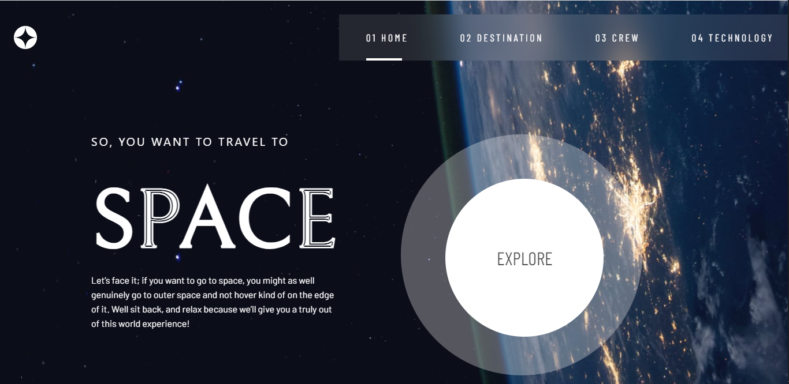

# Frontend Mentor - Space tourism website solution

This is a solution to the [Space tourism website challenge on Frontend Mentor](https://www.frontendmentor.io/challenges/space-tourism-multipage-website-gRWj1URZ3). Frontend Mentor challenges help you improve your coding skills by building realistic projects. 

## Table of contents

- [Overview](#overview)
  - [The challenge](#the-challenge)
  - [Screenshot](#screenshot)
  - [Links](#links)
- [My process](#my-process)
  - [Built with](#built-with)
  - [What I learned](#what-i-learned)
  - [Continued development](#continued-development)
  - [Useful resources](#useful-resources)
- [Author](#author)
- [Acknowledgments](#acknowledgments)

**Note: Delete this note and update the table of contents based on what sections you keep.**

## Overview

### The challenge

Users should be able to:

- View the optimal layout for each of the website's pages depending on their device's screen size
- See hover states for all interactive elements on the page
- View each page and be able to toggle between the tabs to see new information

### Screenshot




### Links

- Solution URL: [Add solution URL here](https://josephgreat/space-tourism.com)
- Live Site URL: [Add live site URL here](https://space-tourism.netlify.app)

## My process

### Built with

- Flexbox
- Mobile-first workflow
- [React](https://reactjs.org/) - JS library
- [Chakra Ui] - Styling

**Note: These are just examples. Delete this note and replace the list above with your own choices**

### What I learned

Quick recap on how to work with fetched data in react


```js
let checkScreenSize = () => {
    let w = window.innerWidth;
    if (w <= 375) setScreenSize("mobile");
    else if (w <= 960 && w > 375) setScreenSize("tablet");
    else if (w <= 1440 && w > 960) setScreenSize("desktop");
    else setScreenSize("desktop");
  };

```


### Continued development

Dynamic rendering of elements

### Useful resources

- [Chakra Ui](https://www.chakraui.com) - This helped me to get familair with Chakra Ui
- [w3School](https://www.w3school.com) - This is an amazing article which helped me finally understand XYZ. I'd recommend it to anyone still learning this concept.

## Author

- Frontend Mentor - [@josephgreat](https://www.frontendmentor.io/profile/josephgreat)


## Acknowledgments

I really appreciate my sister who helped me in getting the best design ideas.
